# Shoptimize: MERN-ecommerce App

<!-- Badges -->

[](https://opensource.org/licenses/MIT)


## Description

Shoptimize is a MERN FullStack Application that is designed to optimize a customer’s e-commerce needs.

The main goal of this app is to streamline the buying and selling process, making it quicker, more accessible, and adaptable to changing consumer behaviors and market trends.

Standard Users can:

- Register/Login to their custom profile to Browse, Filter, Sort through the offered products,
- Provide reviews/ratings and Purchase items through various payment methods (PayPal),
- Live Chat with the Administrator to express their inquiries

While,

Admin Users can:

- Track customer orders and sales using Real-Time Analytics,
- Real-Time Live Chat with multiple users and Edit User Authorization
- Create/Edit/Delete and Sort products with Image Upload

> Github Repository Link: [https://github.com/ShanchaiZ/MERN-ecommerce](https://github.com/ShanchaiZ/MERN-ecommerce)

> Deployed App (Render.com) Link: [Click here to begin Shoptimizing!](https://shoptimize-eqxp.onrender.com)

## Table of Contents

1. [Installation](#installation)
2. [Usage](#usage)
3. [Technologies Used](#technologies-used)
4. [Examples](#examples)
    - [Standard Users](#store-features-for-standard-users)
    - [Admin Users](#store-features-for-admin-users)
5. [License](#license)
6. [Contributions/Questions](#contributionsquestions)

## Installation

For the Backend:
Open the Built-in Terminal for the backend and enter "npm install". This will install the dependencies (like bcrypt, Express, Socket.io, etc) that the application needs to function.

For the Frontend:
Likewise, open the Terminal for the frontend and type "npm install". This will install the essential components required by the application on the frontend (Axios, Bootstrap, Recharts, React-Redux, etc).

You would also need to connect to MongoDB database to be able to create and seed the database.

## Usage

To use this application:

- Start by connecting to the MongoDB Database.

In the backend terminal:
- Use the command "npm run seed:data" to seed data into the MongoDB database.
- Type "node server.js" to run the backend server.

For the frontend, in the terminal:

- Enter "npm run build" to run the front end.

Alternatively, users can click on the Deployed link to access the site without needing to download your own version.

## Technologies Used

Shoptimize uses the following techologies:
```
Backend Tools and tech:
* bcryptjs - Authentication
* jsonwebtoken - Authentication
* Node.js - Allows building of server-side applications
* Express.js - Web framwork for node.js
* MongoDB - Database management
* Mongoose - Object Data Modelling and validation
* dotenv - Manage Configuration Settings
* socket.io - Real time communication between client and server
* Helmet - Web Security
* Cloudinary - Image Cloud Storage API
* Jest - Testing React Components
```

```
Frontend Tools and tech:
* Axios - Handle API calls and HTTP Responses
* Bootstrap - styling
* React.js - Frontend library used to build reusable components
* React-Redux - State management and dispatch actions
* React-simple-star-rating - star rating for reviews
* Js-image-zoom - image zoom for products
* Recharts - Allows use of charts in React
* Paypal/paypal-js - Payment/Checkout solution
```

## Examples

### Store Features for Standard Users:

Home Page:
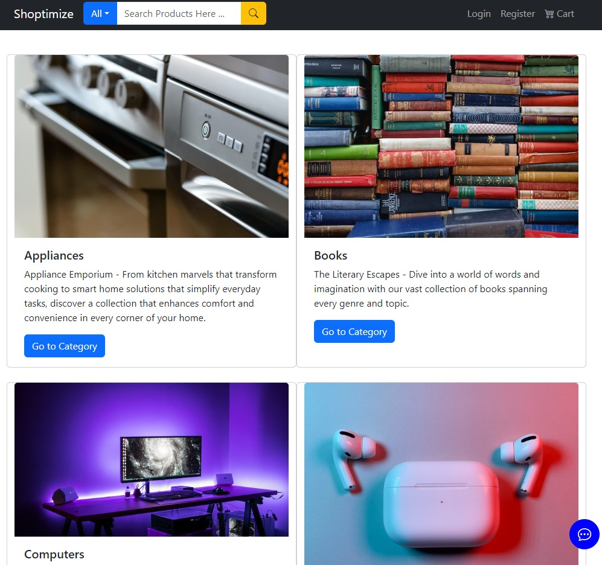

Registration Page:
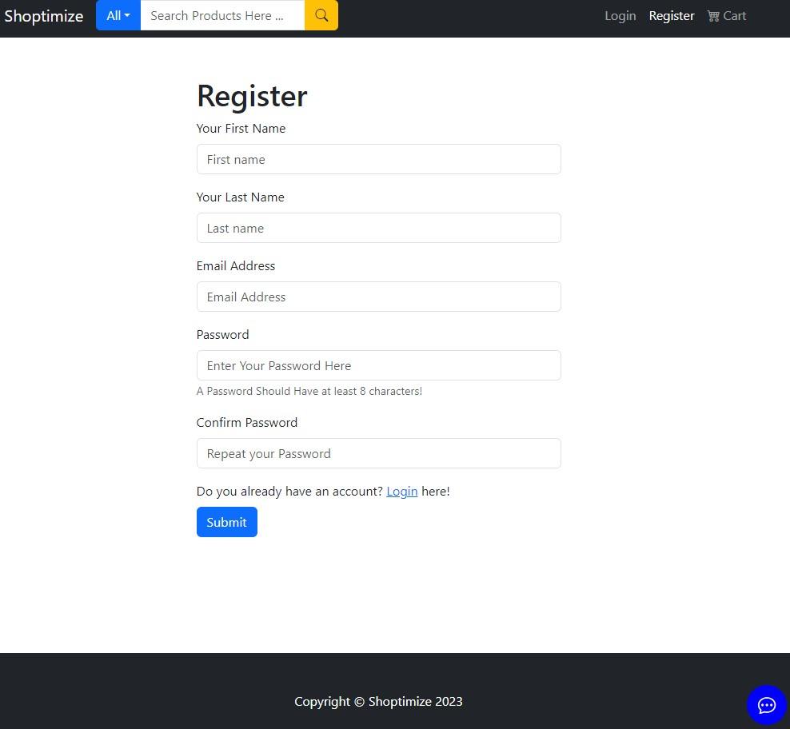

Category Listing Page:
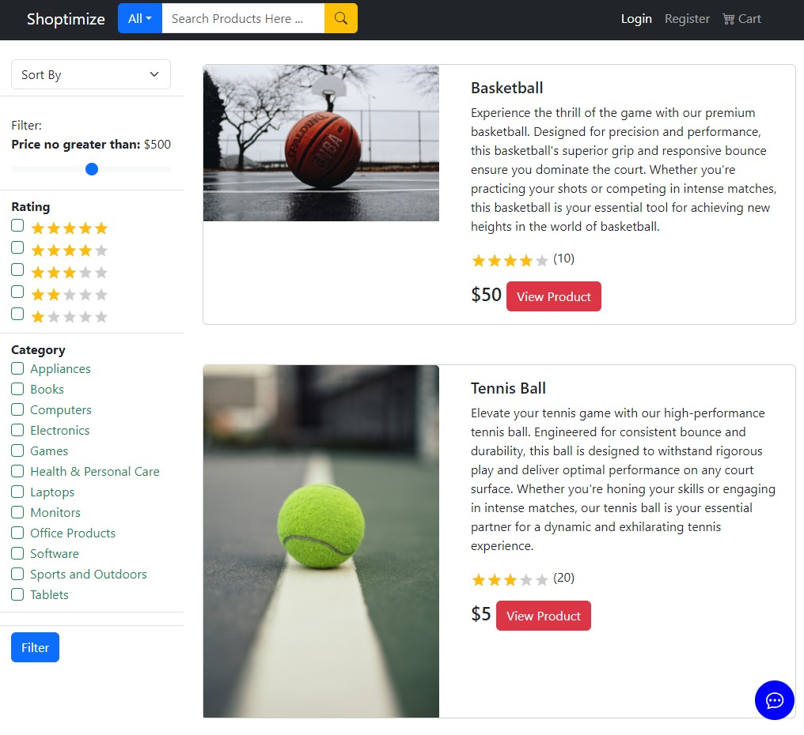

Product Details Page:
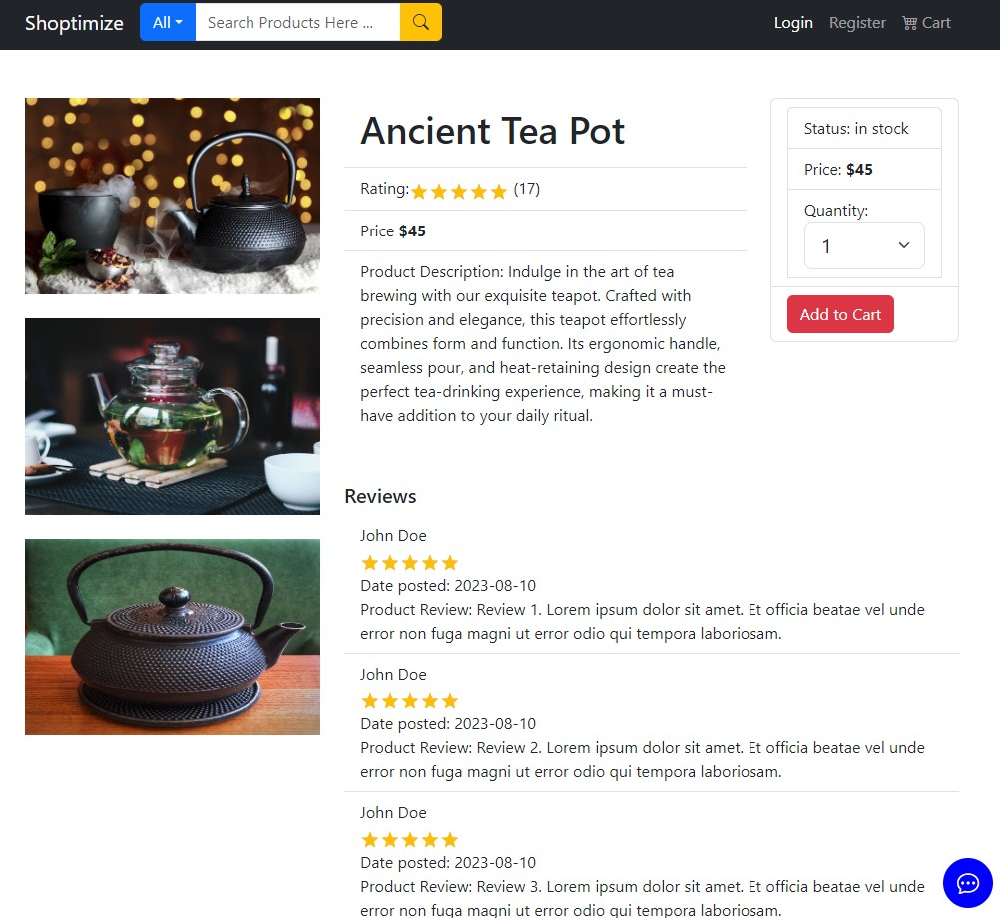

Product Listing Page with Image Zoom and Chat:
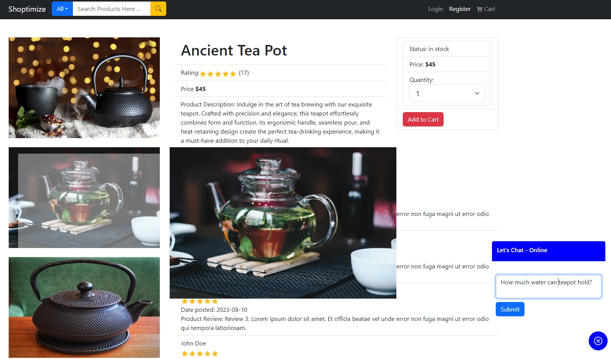

Add to Shopping Cart:
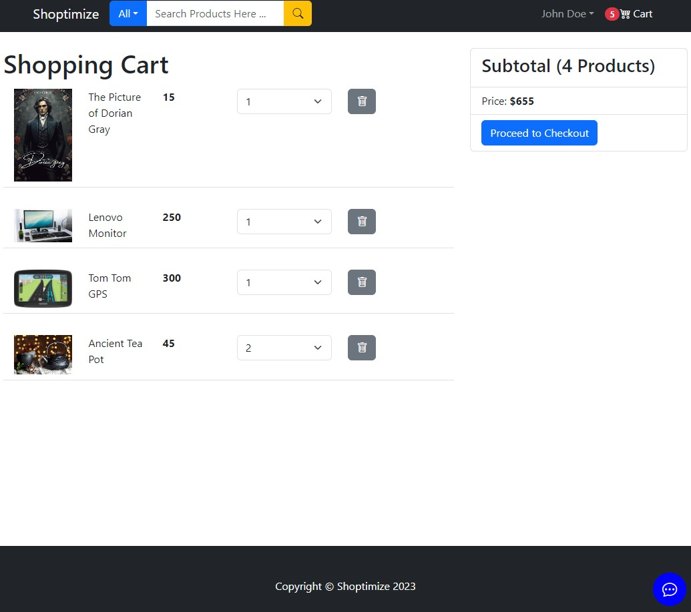

User Order Details Page:
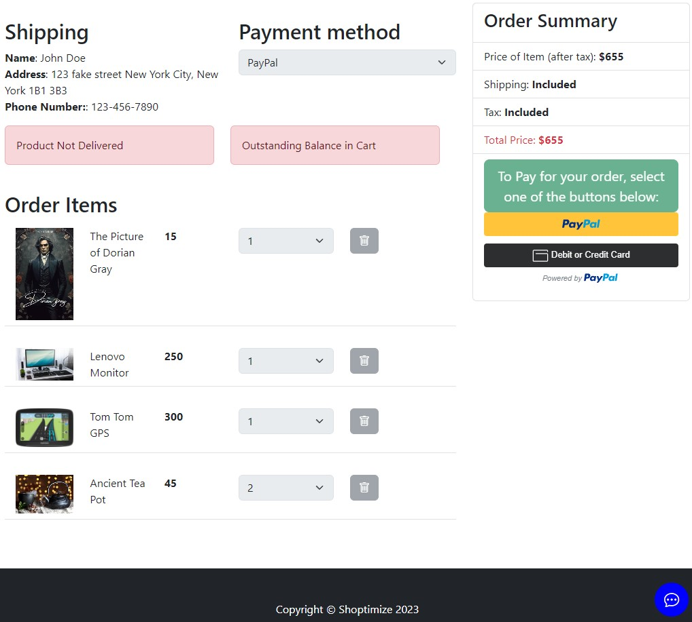

Customer Review for Product:
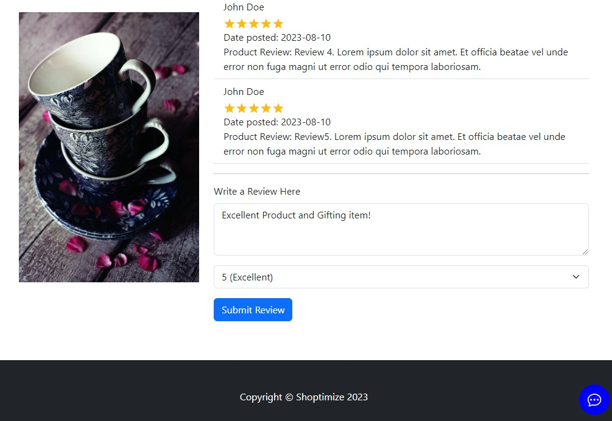


### Store Features for Admin Users:

Admin Order Page:
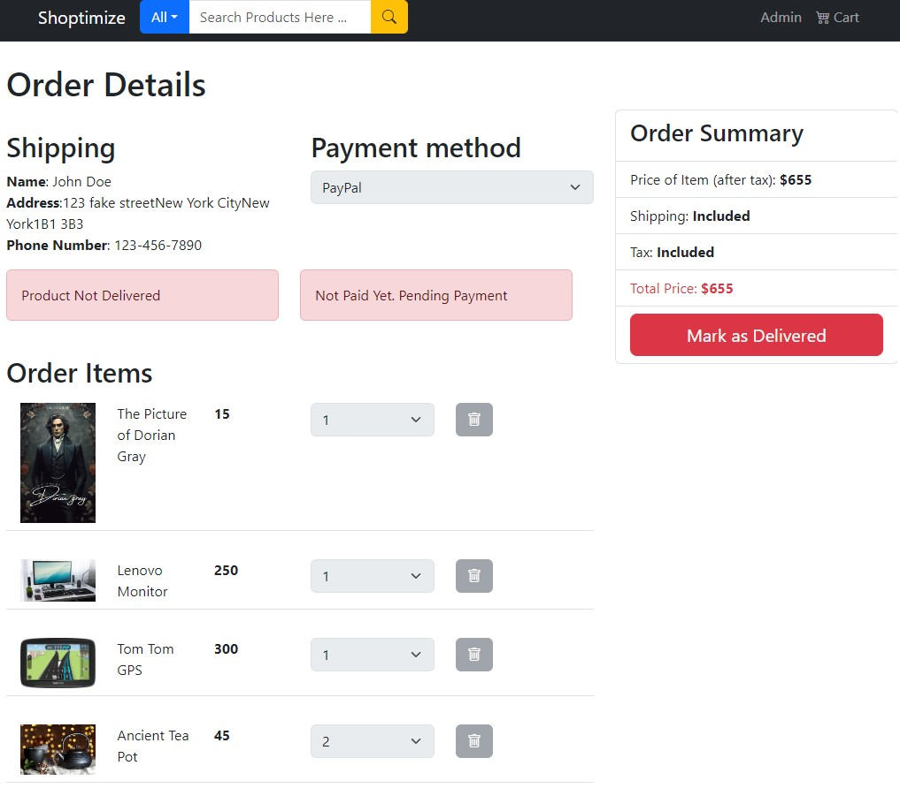

Admin Product Listing:
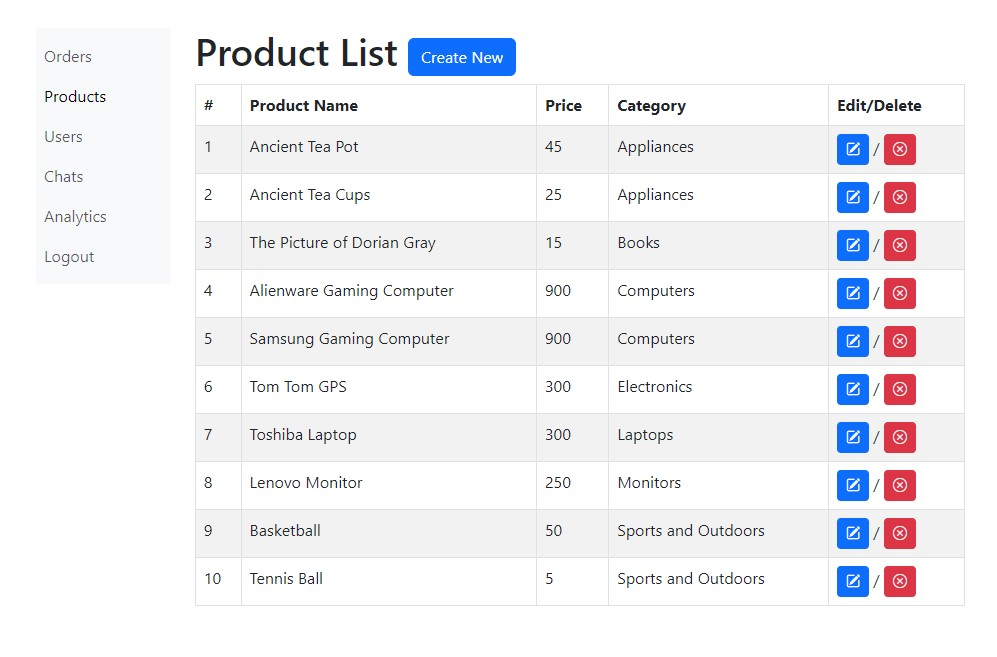

Admin Chat with Customer Page:
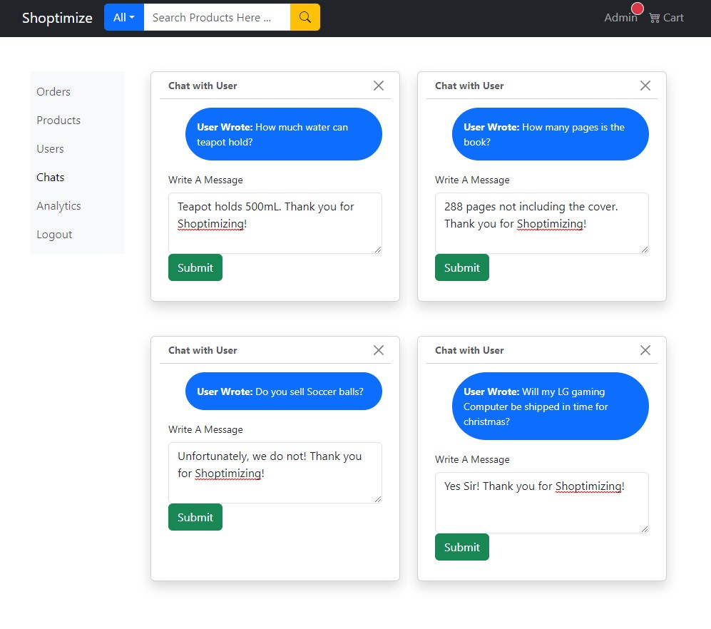

Admin Analytics of Customer Shopping Trends (DEMO):
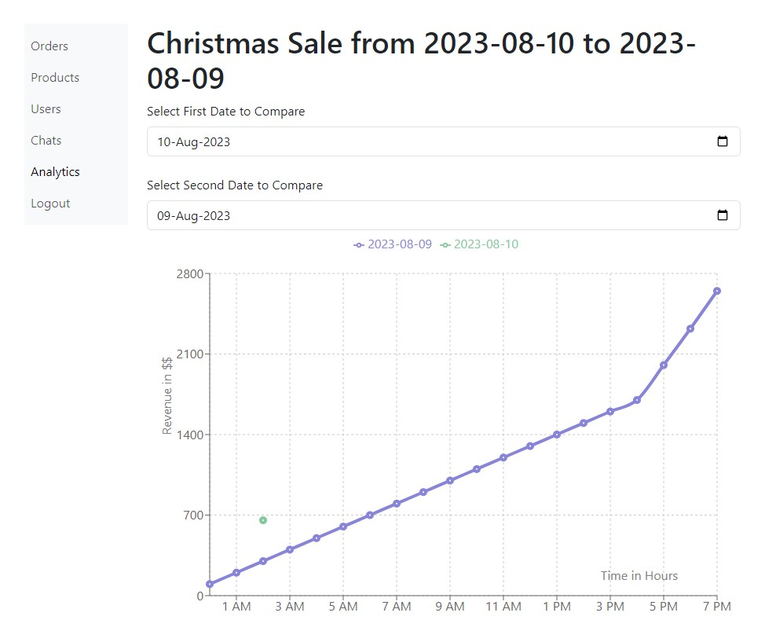

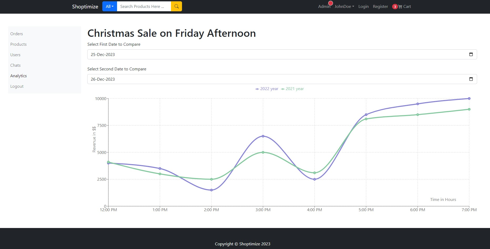

## Testing

## License
This project is under the MIT License.

[](https://opensource.org/licenses/MIT)

## Contribution/Questions

Shanchai Zahid (Github: [ShanchaiZ](https://github.com/ShanchaiZ), Email: shanchai.zahid@gmail.com).
<br>